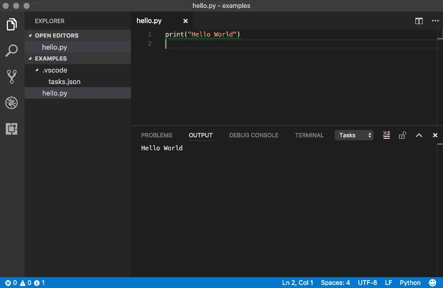

# Basics
Hover over the code snippets below and click *Copy to Editor* to copy the code to a Python file in your editor (top right).

Messy Terminal? `clear`{{execute}} it.

<hr>



You can store any value in a variable, then use it or change its value later on in the program. We can also print out the variables using ```print()```. <span style="color:green">print(</span><span style="color:blue">"Hello World!"</span><span style="color:green">)</span> <span style="color:green">print(</span>

Click here to create new Python file: `week0.py`{{open}}

<pre class="file" data-filename="week0.py" data-target="replace">
print("Hello World")
</pre>

Copy the code above over to the editor and then press
`python week0.py`{{execute}}. You can also type that yourself via the Terminal (bottom right) and then press <kbd>ENTER</kbd> to execute it.


# What Should Happen
You should see hello world print in your terminal. You have run your first code.

<marquee style='color: blue;'><b>Yay you've completed part 1!</b></marquee>
